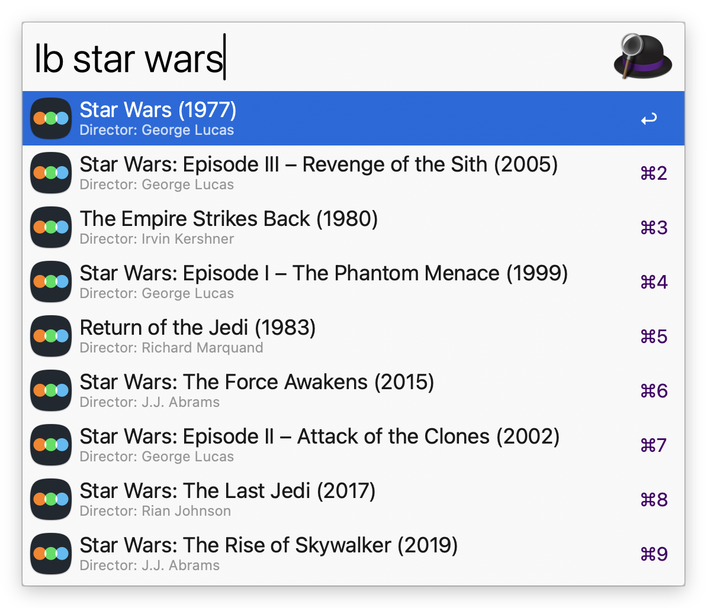

# Alfred Letterboxd Workflow

Search [Letterboxd](https://letterboxd.com) for films and people directly from [Alfred](https://www.alfredapp.com/).



## Installation

Download the latest `letterboxd.alfredworkflow` file from the [Releases](https://github.com/jparise/alfred-letterboxd/releases) page and double-click to install.

## Usage

### Film Search

Type `lb` followed by your search query to search films:

```
lb raiders of the lost ark
lb parasite 2019
lb everything everywhere
```

### People Search

Type `lbp` followed by the person's name to search cast and crew:

```
lbp harrison ford
lbp greta gerwig
lbp steven spielberg
```

## Requirements

- [Alfred Powerpack](https://www.alfredapp.com/powerpack/)
- Python 3.9+ (included with macOS Ventura and later)

```sh
python3 --version  # Should show 3.9 or higher
```

## Development

### Building

```sh
make workflow       # Build Alfred workflow
make install        # Build and install in Alfred
make test           # Run tests
make lint           # Lint code
```

## License

This software is released under the terms of the [MIT License](LICENSE).
